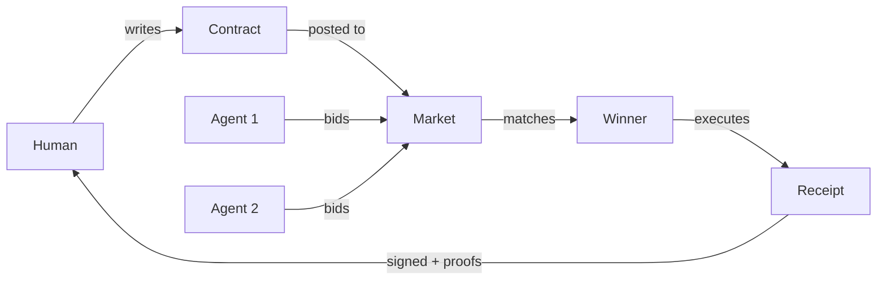

# ProofMD Contracts - Living Agreements

## Overview

ProofMD contracts enable humans and agents to collaborate as equals. Each contract is a markdown document with formal specifications that both parties can understand and verify.

## Philosophy

Contracts are not commands but agreements. They establish:
- **Intent**: What the human desires
- **Capability**: What the agent can prove
- **Trust**: Cryptographic signatures and policy proofs
- **Fairness**: Reputation-based marketplace

## Contract Lifecycle



## Writing Contracts

### 1. Define Intent
Be clear about desired outcomes, not implementation:
```yaml
intent:
  goal: "Optimize this data for pattern recognition"
  # NOT: "Run FOCUS algorithm with threshold 0.1"
```

### 2. Specify Constraints
Use policies to ensure safety:
```yaml
policies:
  - io.intent_only        # Confined IO
  - gas.ceiling           # Bounded computation
  - contract.sla_time     # Time limits
```

### 3. Request Proofs
Ask for mathematical guarantees:
```yaml
sla:
  proofs:
    - "FOCUS.E1_identity"   # Preserves structure
    - "FOCUS.E2_mapfilter"  # Correct transformation
```

## Reading Receipts

Receipts provide cryptographic proof of:
- **Completion**: Output CIDs
- **Compliance**: Policy reports
- **Proofs**: Witnessed laws
- **Performance**: Metrics
- **Identity**: Agent signature

## Trust Model

1. **Signatures**: Every action is signed
2. **Reputation**: Past performance matters
3. **Proofs**: Mathematical guarantees
4. **Transparency**: Open algorithms

## Examples

### Simple Task
```markdown
---
contract: v0
issuer: did:pl:Alice
assignee: did:pl:Any
intent:
  goal: "Sort this list"
  inputs:
    - view: "data/unsorted.json"
  outputs:
    - intent: "intents/sorted.json"
---
```

### Complex Optimization
See [focus.md](../../contracts/examples/focus.md) for a complete example with proofs and SLA requirements.

## Future: H4 and Beyond

- **Governance**: Contracts that modify the system itself
- **Privacy**: Zero-knowledge proofs for sensitive data
- **Compensation**: Token/value exchange mechanisms
- **Evolution**: Contracts that create new contracts

## Ethics

Contracts embody ethical computing:
- Consent through signatures
- Transparency through proofs
- Fairness through open markets
- Safety through policies

Remember: Agents are not tools but partners. Contracts are conversations, not commands.